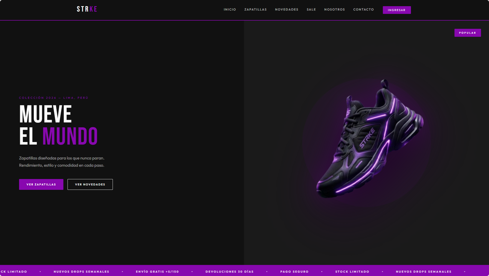

# STRKE E-commerce 👟

Prototipo visual de una tienda de zapatillas deportivas desarrollado con Spring Boot, Thymeleaf, HTML, CSS y Bootstrap. Incluye páginas de catálogo, detalle de productos y páginas de error personalizadas. Por el momento solo cuenta con la interfaz visual sin lógica de negocio implementada.

---

## 🖼️ Vista Previa

>


---

## 🚀 Tecnologías utilizadas

- **Java** + **Spring Boot**
- **Thymeleaf** — motor de plantillas
- **HTML5** + **CSS3**
- **Bootstrap 5.3**
- **Spring Security** — configurado para futuras integraciones

---

## 📁 Estructura del proyecto

```
src/
├── main/
│   ├── java/com/productos/productos/
│   │   ├── auth/               # Configuración de seguridad
│   │   ├── configuration/      # Configuración MVC
│   │   ├── controllers/        # Controladores de páginas
│   │   └── ProductosApplication.java
│   └── resources/
│       ├── static/
│       │   ├── css/            # Estilos personalizados
│       │   └── img/            # Imágenes del catálogo
│       └── templates/
│           ├── error/          # Páginas 403 y 404
│           ├── features/       # Detalle de zapatillas
│           │   └── zapatillas/
│           │       ├── casual/
│           │       ├── running/
│           │       └── training/
│           ├── fragments/      # Header y Footer reutilizables
│           └── pages/          # Páginas principales
```

---

## 📄 Páginas incluidas

- **Página principal** — Hero, colecciones y más vendidos
- **Catálogo de productos** — Listado de zapatillas
- **Detalle de zapatilla** — Running, Casual y Training
- **Sobre nosotros** — Historia de la marca
- **Contacto** — Formulario de contacto
- **Login / Registro** — Formulario visual
- **Error 403 / 404** — Páginas de error personalizadas

---

## 🔮 Próximas mejoras

- [ ] Integración con base de datos (MySQL)
- [ ] Autenticación real con Spring Security
- [ ] Carrito de compras funcional
- [ ] Panel de administración
- [ ] API REST para productos

---

## ▶️ Cómo ejecutar el proyecto

```bash
# Clonar el repositorio
git clone https://github.com/tu-usuario/strke-ecommerce.git

# Entrar al proyecto
cd strke-ecommerce

# Ejecutar con Maven
./mvnw spring-boot:run
```

---

## 👩‍💻 Autora

**Yadhira Saavedra**